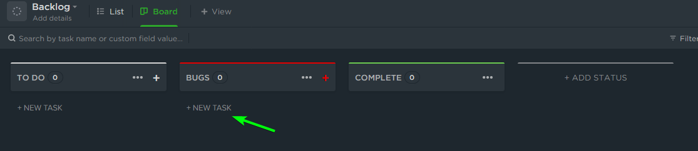
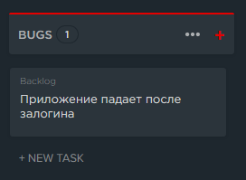

### Оглавление
* [Что такое тикет](#что-такое-тикет)
* [Как создать тикет с багом](#как-создать-тикет-с-багом-на-примере-clickup)
* [Правила создания баг репортов](#правила-создания-баг-репортов)
* [Что репортить, а что нет](#что-репортить-а-что-нет)
* [Как проверять воспроизведение старых багов](#как-проверять-воспроизведение-старых-багов)
* [На каких браузерах тестить в первую очередь](#на-каких-браузерах-тестить-в-первую-очередь)
* [Куда грузить видео, скриншоты и прочие файлы](#куда-грузить-видео-скриншоты-и-прочие-файлы)
* [Дополнительно](#дополнительно)

### Что такое тикет

Тикет — это виртуальная карточка с описанием ошибки, которую требуется исправить или требованием (задачей).

Каждый тикет имеет следующие аттрибуты:

* Автор, создавший тикет;
* Заголовок (Short summary) — обычно это короткое описание проблемы или задачи по которому ее можно выделить из списка;
* Тип тикета (Type):

    * Ошибка (defect) — сообщение об ошибке, которую требуется исправить;
    * Требование (enhancement) — требование расширения или создания новой функциональности;
    * Задача (task) — общая задача;

* Полное развернутое описание ошибки / задачи — обычно, если это ошибка, описывается место ее возникновения и последовательность действий, которая привела к ошибке;
* Приоритет (Priority):

    * Блокирующий (blocker) — продолжение работы без исправления ошибки / выполнения требования невозможно;
    * Критический (critical) — продолжение работы возможно, но ошибка / требование должна быть исправлена как можно скорее;
    * Высокий (major) — стандартный приоритет для исправления ошибок;
    * Средний (minor) — ошибка не критична;
    * Низкий (trivial) — ошибка редковоспроизводима;

* Компонент (Component) — компонент (логическая часть) системы, к которой принадлежит тикет;
* Ключевые слова (Keywords) — ключевые слова, облегчающие поиск;
* Этап (Milestone) — обычно, проект делится на несколько этапов (alpha, beta, release etc), к которому можно отнести тикет;
* Версия (Version) — версия компонента, к которой относится тикет;
* Исполнитель (Assign To) — исполнитель, назначеный данному тикету;
* Дублер (Cc);

### Как создать тикет с багом (на примере ClickUp)

1. Выбрать нужный статус. В данном случае есть специальный статус для багов - BUGS. Нажать "+ NEW TASK"

2. Вести в поле **Task name** заголовок тикета и нажать Enter. В выбранном статусе появится карточка:

3. Теперь нужно добавить описание с подробностями. Для этого нужно открыть тикет, кликнув по нему.

4. В поле Description нужно указать всю необходимую информацию о баге.

### Правила создания баг репортов

#### Заголовок должен кратко и ясно описывать суть бага.
Примеры заголовков:
* При клике на кнопку "Старт" ничего не происходит.
* Приложение зависает намертво при подборе монеты.
* Не отображается фон главной страницы.

Примеры заголовков, которые не дают информации о баге:
* Всё плохо.
* Игра лагает.
* Кнопка не кликается.
* Картинку не видно.

#### Описание должно содержать:
1. Шаги для воспроизведения бага.
    * Шаги описывать кратко, в неопределенной форме (что делать/что сделать).
    * Шагов не должно быть больше, чем нужно для воспроизведения бага.
    * Каждое действие писать отдельным пунктом.
    * Шаг "Открыть стенд"/"Открыть приложение" можно опустить, если он указан ниже. Если же нужно четко указать, что баг происходит строго после запуска приложения - лучше оставить.
1. Ожидаемый результат (ОР).
    * Стоит указать, если есть конкретное ожидание по ТЗ, либо если результат не совпадает с ожиданиями пользователя.
1. Фактический результат (ФР).
    * Текстовое описание бага. Если есть дополнительные эффекты - их стоит также указать сюда.
1. Стенд (для веб приложений), либо версия приложения (если требуется в проекте).
1. Окружение (если требуется в проекте) - оборудование, ОС устройства, браузер на котором тестируется приложение.
1. **Обязательно** скриншот или видео с багом - аттачем или ссылкой.
    * Скриншот должен отображать суть бага. Если баг сложный, либо сложные шаги - лучше выложить видео.
    * Видео должно содержать действия воспроизведения и сам баг.
    * Видео не должно содержать лишнюю информацию, т.е. не нужно прикреплять пятиминутное видео, в котором багу отводится минута.
1. Дополнительная информация, как лог приложения и т.п.
    * Лог можно прикладывать скриншотом (если умещается), файлом, либо ссылкой на https://gist.github.com/
    * Если в консоли есть ошибки - их прикладывать **обязательно**. В браузерах консоль можно посмотреть нажатием F12 (Cmd+Opt+J для Mac).

Статья на тему: https://habr.com/ru/company/docsvision/blog/264163/

#### Пример описания бага

> **Заголовок**
>
> Джойстик отображается, когда он отключен в настройках
> 
> **Шаги**
> 1. Запустить игру
> 2. Открыть настройки (по дефолту джойстик отключен)
> 3. Скипнуть обучение
> 4. Управлять персонажем
> 
> **Ожидаемый результат**
>
> Джойстик не отображается
> 
> **Фактический результат**
>
> Джойстик отображается
> 
> **Видео/скриншоты**
>
> <видео с примером>

### Что репортить, а что нет
**Нужно репортить**

1. Несоответствие приложения пользовательскому ожиданию (не путать с личными предпочтениями).
    Например:
    * При клике на кнопку ничего не происходит.
    * Под текстом "Изображение:" нет изображения.
    * Эффекты остаются на экране после проигрывания.

1. Несоответствия приложения ТЗ.
1. Сообщения об ошибках в консоли. Особенно, если сообщений очень много.
1. Серьезные просадки фпс.
1. Кривая верстка на сайте.
1. Прочие примеры багов отсюда: https://training.qatestlab.com/blog/technical-articles/category-bug-game/

**Не нужно репортить**
1. Геймдизайн
    Примеры:
    * Кнопка находится в неудобном месте.
    * Визуальный эффект некрасивый.
    * У мобов слишком много ХП.
2. Фичреквесты.

Если кратко - репортить только баги. Если есть сомнения, репортить что-то или нет - стоит спросить в чате, либо, если ответа не будет, зарепортить.

### Как проверять воспроизведение старых багов

1. Просмотреть тикет, понять суть бага. Если будут непонятные моменты - спросить в чате.
2. Открыть приложение, на котором требуется воспроизвести баг.
3. Пройти по шагам, описанным в тикете, либо, если шаги отсутствуют, сориентироваться по заголовку/видео.
4. По завершению проверки:
    * Если баг из описания не был найден - баг пофикшен, тикет следует закрыть.
    * Если баг удалось воспроизвести - тикет нужно переоткрыть.
    * Если был найден новый (другой) баг - нужно завести новый багрепорт.

### На каких браузерах тестить в первую очередь

Списки по убыванию приоритета.

Десктоп:
1. Google Chrome
2. (mac) Safari
3. Edge
4. Firefox

Тач:
1. Chrome
2. (iOS) Safari
3. Samsung Internet
4. Firefox
5. Opera

### Куда грузить видео, скриншоты и прочие файлы

1. Если сервис позволяет - следует загружать аттачем к тикету. Например, в Trello можно загрузить видео до 10мб. В ClickUp хранилище ограничено, поэтому аттачем грузить не стоит.
2. Объемную текстовую информацию можно выкладывать на https://gist.github.com/ (хорошо подходит для логов), либо использовать гугл документы.
3. Объемные файлы, либо если нельзя грузить аттачем - следует выгружать на гугл диск. При этом обязательно нужно сделать файлы доступными по ссылке.

Мы используем сервисы гугла, не стоит использовать аналогичные сервисы от других компаний, как Яндекс.Диск, One.Drive, а также документы от этих и прочих компаний.

### Дополнительно
**Важно**: по всем вопросам сначала обращаться в чат, прежде чем искать информацию самостоятельно. 
